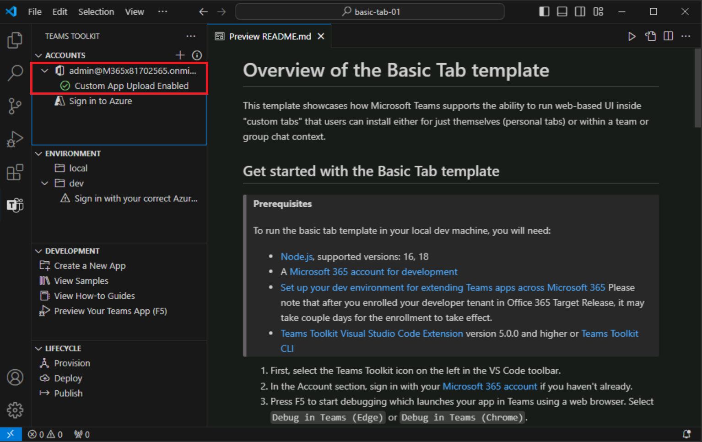
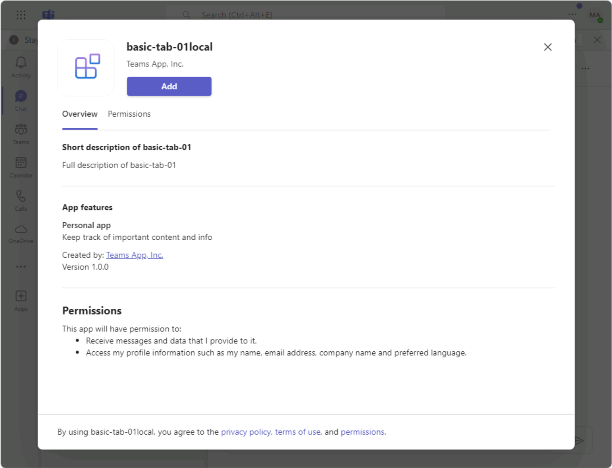

# Übung 3: Ausführen Ihrer Teams-App

In dieser Übung führen Sie die Teams-App lokal aus.

## Aufgabe 1: Melden Sie sich bei Microsoft 365 an

1. Öffnen Sie in Visual Studio Code das **Teams-Toolkit** und wählen Sie **Bei Microsoft 365 anmelden** aus.

    

2. Wählen Sie **Anmelden** im Popup-Dialogfeld aus. Sie werden zu einem Browser weitergeleitet, um sich mit den **Anmeldeinformationen für Ihr Microsoft 365-Konto** anzumelden.  Geben Sie Ihre Administratoranmeldeinformationen ein.

3. Wenn Sie erfolgreich angemeldet wurden, schließen Sie den Browser und kehren Sie zu Visual Studio Code zurück. Unter Ihrem Konto im Teams-Toolkit wird die Meldung **Hochladen einer benutzerdefinierten App aktivieren** angezeigt, um darauf hinzuweisen, dass Ihr Mandant korrekt konfiguriert ist.

    

## Aufgabe 2: Lokales Ausführen der App

Jetzt führen Sie das Projekt aus, um zu sehen, wie es in Microsoft Teams aussieht.

1. Wählen Sie auf der Seitenleiste das Symbol **Debuggen** aus, um den Bereich **AUSFÜHREN UND DEBUGGEN** zu öffnen.
2. Im Bereich **AUSFÜHREN UND DEBUGGEN** wählen Sie entweder **Chrome** oder **Edge** im Dropdownlistenfeld als den Browser aus, den Sie zum Debuggen Ihres Bots verwenden möchten.  Dann wählen Sie die Schaltfläche **Wiedergeben** aus (oder drücken Sie die **F5**-Taste), um die Debugsitzung zu starten.
3. Das Teams-Toolkit führt die Überprüfung der Voraussetzungen durch (das kann ein oder zwei Minuten dauern).
4. Als Nächstes wird Microsoft Teams vom Teams-Toolkit in Ihrem ausgewählten Browser geöffnet.
5. Melden Sie sich mit dem gleichen **Microsoft 365**-Konto an, mit dem Sie sich beim Teams-Toolkit angemeldet haben.
6. Dann zeigt Teams eine Option zum Installieren Ihrer App an. Wählen Sie **Hinzufügen** aus, um eine Vorschau der App anzuzeigen.
7. Bei der Vorschau wird *local* an den Namen Ihrer App angehängt. Mit diesem Suffix wird darauf hingewiesen, dass die App lokal ausgeführt wird und nicht bereitgestellt wurde.

    

8. Um mehr über die Projektstruktur und die Verwendung und Anpassung Ihrer App zu erfahren, öffnen Sie die Datei **README.md** im Projektordner.

Sie haben jetzt eine Teams-App aus einem Beispiel erstellt und lokal ausgeführt.
