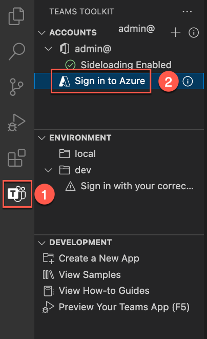

# Übung 1: Erstellen von Azure-Ressourcen zum Hosten einer Teams-Registerkarten-App

In dieser Übung werden Sie zunächst eine Teams-Registerkarten-App mithilfe des Teams-Toolkits für Visual Studio Code erstellen und bereitstellen. In einer späteren Übung richten Sie die App so ein, dass sie in Azure gehostet wird.

**Hinweis:**  Für die Übungen in diesem Trainingsmodul wird das Teams-Toolkit V5.0.0 verwendet. Bei den folgenden Schritten wird davon ausgegangen, dass die Teams-Toolkit-Erweiterung installiert ist.

## Aufgabe 1: Erstellen einer neuen Registerkarten-App

1. Wählen Sie in Visual Studio Code auf der Aktivitätsleiste das Symbol **Microsoft Teams** aus.

1. Wählen Sie im Bereich „Teams-Toolkit“ die Schaltfläche **Neue App erstellen** aus.

1. Wählen Sie in den Optionen **Registerkarte** aus.

    

1. Wählen Sie als Nächstes die Option **React mit Fluent UI** aus.

    

1. Wählen Sie in den Optionen für die Programmiersprache **JavaScript** aus.

1. Wählen Sie einen **Speicherort** für den Projektordner und alle zugehörigen Dateien der Registerkarten-App aus.

1. Geben Sie als Anwendungsnamen **hello-tab** ein, und drücken Sie die EINGABETASTE.

1. Der Aufbau des Projektgerüsts beginnt. Wenn das Projektgerüst erstellt wurde, wird ein neues Visual Studio Code-Fenster geöffnet, in dem das neue Projekt geladen ist.

    

1. Wählen Sie in Visual Studio Code **Ausführen > Debuggen starten** aus oder drücken Sie die Taste **F5**, um die Debuggingsitzung zu starten.

1. Die Anwendung wird in Visual Studio Code erstellt und gestartet. Führen Sie die Debuggingsitzung aus, bevor Sie mit der Bereitstellung von Azure-Ressourcen beginnen.

1. Wenn die App erfolgreich getestet wird, beenden Sie die lokale Ausführung der App.

1. Um die Debuggingsitzung zu beenden und die Ausführung der App zu stoppen, können Sie entweder den Browser schließen, **Ausführen > Debuggen beenden** auswählen oder **UMSCHALT+F5** drücken.

## Aufgabe 2: Anmelden bei Azure im Teams-Toolkit

Melden Sie sich mit dem Konto Ihres **Azure-Abonnements** bei Azure an.

1. Wählen Sie auf der Aktivitätsleiste das Symbol **Microsoft Teams** aus.

1. Wählen Sie im Bereich „Teams-Toolkit“ unter **Konten** die Option **Bei Azure anmelden** aus.

    

1. Wählen Sie im angezeigten Dialogfeld die Option **Anmelden** aus.

    

## Aufgabe 3: Bereitstellen der Ressourcen

Jetzt können Sie die Ressourcen bereitstellen, die für Ihre Teams-Registerkarten-App erforderlich sind.

1. Wählen Sie im Bereich „Teams-Toolkit“ unter **Lebenszyklus** die Option **Bereitstellen** aus.

    

1. Als Nächstes müssen Sie eine Ressourcengruppe auswählen, in der Sie die Ressourcen bereitstellen können. Oder Sie erstellen eine neue Ressourcengruppe, indem Sie im Menü **Ressourcengruppe auswählen** die Option **Neue Ressourcengruppe** auswählen.

    

1. Das Tool schlägt für die Ressourcengruppe automatisch einen Namen wie „rg-hello-tab0989fd-dev“ vor. Drücken Sie die **EINGABETASTE**.

1. Wählen Sie als Nächstes den **Standort USA Osten** für die neue Ressourcengruppe aus, und drücken Sie die **EINGABETASTE**.

1. Daraufhin wird ein Dialogfeld angezeigt, in dem Sie Ihre Auswahl bestätigen müssen. Wählen Sie hier **Bereitstellen** aus.

    

1. Die Bereitstellung beginnt für alle Ressourcen, die Sie zum Hosten der Teams-Registerkarten-App in Azure benötigen. Die Bereitstellung kann eine Weile dauern.

Sie haben nun erfolgreich alle Ressourcen bereitgestellt, die Sie zum Hosten der Teams-Registerkarten-App benötigen.

Als Nächstes stellen Sie den Quellcode Ihrer App für diese Ressourcen bereit.
