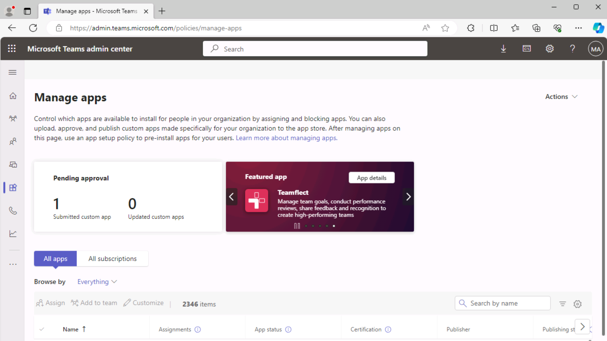

# Übung 3: Veröffentlichen Ihrer Teams-Registerkarten-App

In dieser Übung erfahren Sie, wie Sie Ihre App im Organisationsspeicher veröffentlichen.

## Aufgabe 1: Veröffentlichen Ihrer App im Store

1. Wählen Sie in Visual Studio Code auf der Aktivitätsleiste das **Microsoft Teams-Symbol** aus, um den Bereich **Teams-Toolkit** zu öffnen.

    a. 

1. Wählen Sie im Bereich „Teams-Toolkit“ unter **Lebenszyklus** die Option **Veröffentlichen** aus.

1. Ein Dialogfeld gibt an, dass die App erfolgreich im Microsoft Teams-Verwaltungsportal veröffentlicht wurde.

1. Wählen Sie im Dialogfeld die Option **Zum Verwaltungsportal wechseln** aus, um das **Microsoft Teams Admin Center** zu öffnen.  Melden Sie sich mit Ihrem **Microsoft 365-Mandantenkonto** an.

    a. 

    a. 

1. Suchen Sie im Menü **Apps verwalten** von Teams Admin Center das Textfeld **Nach Name suchen**. 
1. Geben Sie **hello-tab** ein, um die Liste der Apps zu filtern. **Wählen Sie dann die App aus**, um die Details der App anzuzeigen.

    

1. Wählen Sie im Detailbereich der App **hello-tab** die Option **Veröffentlichen** aus.

    

1. Wählen Sie im Dialogfeld **Ihre benutzerdefinierte App veröffentlichen?** die Option **Veröffentlichen** aus.

1. Ein grünes Banner gibt an, dass die App „hello-tab“ veröffentlicht wurde.

    

Nachdem Ihre App nun im Organisationsspeicher veröffentlicht wurde, öffnen Sie Microsoft Teams, und installieren Sie die App aus dem Organisationsspeicher.

## Aufgabe 2: Installieren der App aus dem Store

1. Öffnen Sie den Microsoft Teams-Client, oder melden Sie sich online bei Microsoft Teams ([teams.microsoft.com](teams.microsoft.com)) mit Ihren **Microsoft 365-Mandantenanmeldeinformationen** an.
2. Wechseln Sie in Microsoft Teams zu **Apps**, um den Organisationsspeicher anzuzeigen. Wählen Sie unter **Für Ihre Organisation erstellt** die Kachel **hello-tab** aus.

    a. 

3. Wählen Sie im Dialogfeld für die App-Installation die Option **Hinzufügen** aus.

    a. 

4. Die App wird geöffnet, und die folgende Meldung wird angezeigt: **Ihre App wird in Ihrer Azure-Umgebung ausgeführt**.

    
