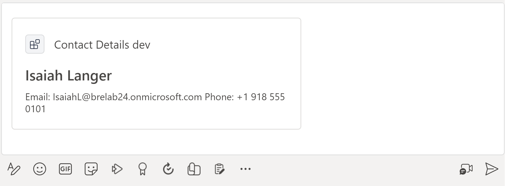

---
lab:
  title: 'Implementieren einer Nachrichtenerweiterung, die Daten aus Microsoft Graph abruft'
  module: Exercise 1
---

# Übung 1: Implementieren einer Nachrichtenerweiterung, die Daten aus Microsoft Graph abruft

## Szenario

Angenommen, Sie wurden gebeten, dem IT-Support-Team bei der Erstellung einer Nachrichtenerweiterung zu helfen, die es Teammitgliedern ermöglicht, Kontaktinformationen für Benutzer*innen abzurufen und die Kontaktdetails mithilfe von Karten in Nachrichten in Teams einzufügen.  In dieser Übung implementieren Sie eine Nachrichtenerweiterung, die Benutzerdaten aus Microsoft Graph abruft.  Die Lösung wurde bereits mit dem Teams-Toolkit gerüstet, Sie müssen jedoch Änderungen vornehmen, um Funktionen zu implementieren.

## Übungsaufgaben

Ihr Ziel besteht darin, sicherzustellen, dass die App über die folgenden Funktionen verfügt:


- App-Benutzer:innen geben den Namen eines Benutzers oder einer Benutzerin in die Benutzeroberfläche der Nachrichtenerweiterung ein.
- Die App verwendet den `users`-Endpunkt der Graph-API, um Benutzer:innen anhand des Anzeigenamens zu finden, und die Ergebnisse werden aufgelistet.
- Wenn App-Benutzer:innen den oder die gewünschte:n Benutzer:in aus den Suchergebnissen auswählen, können sie die gewünschte Karte in eine Nachricht in Teams einfügen.
- Die Karte zeigt den Anzeigenamen, die E-Mail-Adresse und die Telefonnummer des Benutzers bzw. der Benutzerin an.




Sie müssen die folgenden Aufgaben ausführen, um die Übung abzuschließen:

1. Greifen Sie auf das Projekt zu, und überprüfen Sie es.
2. Schließen Sie die Suchfunktion ab.
3. Fügen Sie die Graph-Abfragen hinzu.
4. Stellen Sie Ressourcen für die Nachrichtenerweiterung bereit.
5. Konfigurieren von Microsoft Graph-Zugriffsberechtigungen.
6. Bereitstellen in Azure
7. Führen Sie die App aus, und testen Sie sie.

**Geschätzte Abschlusszeit:** 25 Minuten

## Aufgabe 1: Zugreifen auf das Projekt und Überprüfen des Projekts

Das Gerüst für die Nachrichtenerweiterungs-App wurde mit dem Teams-Toolkit erstellt.  Die App wurde auch aktualisiert, um mithilfe der JavaScript-Clientbibliothek von Microsoft Graph Benutzerdaten aus Microsoft Graph abzurufen.  Ein Teil des Codes ist unvollständig.

1. Laden Sie das Projekt [ContactDetails.zip](https://github.com/MicrosoftLearning/APL-4001-Build-collaborative-apps-for-Microsoft-Teams/raw/master/Allfiles/Labs/Starter/ContactDetails.zip) aus dem Ordner [Starter](https://github.com/MicrosoftLearning/APL-4001-Build-collaborative-apps-for-Microsoft-Teams/tree/master/Allfiles/Labs/Starter) herunter.
2. Extrahieren Sie den Inhalt der ZIP-Datei in einen Ordner namens **ContactDetails** auf Ihrem Computer, und öffnen Sie dann den Ordner in Visual Studio Code.  
3. Überprüfen Sie die Projektverzeichnisse und Dateien im Explorer-Bereich von Visual Studio Code, um sich mit dem Quellcode vertraut zu machen.  Wichtige Dateien und Ordner umfassen:

| Ordner\Datei | Contents |
| --- | --- |
| `teamsapp.yml` | Die Hauptprojektdatei beschreibt Ihre Anwendungskonfiguration und definiert die Gruppe von Aktionen, die in jeder Lebenszyklusstufe ausgeführt werden sollen. |
| `teamsapp.local.yml` | Dadurch wird `teamsapp.yml` durch Aktionen außer Kraft gesetzt, die das lokale Ausführen und Debuggen ermöglichen. |
| `.vscode/` | VSCode-Dateien für das lokale Debuggen. |
| `appPackage/` | Die App-Paketdateien, darunter das Manifest der Teams-App. |
| `infra/` | Vorlagen für die Bereitstellung von Azure-Ressourcen. |
| `index.js` | Einstiegspunkt und `restify`-Handler der Anwendung. |
| `teamsBot.js` | Teams-Aktivitätshandler.  |

## Aufgabe 2: Vervollständigen der Suchfunktion

In der Lösung fehlt der Code zum Speichern des Wertes der Suchabfragezeichenfolge, die für die Graph-Abfrage verwendet werden soll.  Aktualisieren Sie den Code so, dass dieser Wert in einer Variablen mit dem Namen `searchQuery` gespeichert wird.

1. Navigieren Sie zur Datei **TeamsBot.ts**.
2. Suchen Sie in der `handleTeamsMessagingExtensionQuery`-Methode den Kommentar **// Get the search context from the query parameters (Suchkontext aus Abfrageparametern abrufen)** in Zeile 81. Fügen Sie in der nächsten Zeile die folgende Codezeile hinzu:

    ```JavaScript
    const searchQuery = query.parameters[0].value;
    ```

## Aufgabe 3: Aktualisieren der Graph-Abfrage

In der Lösung fehlt der API-Pfad für die Graph-Abfrage, die die Suchzeichenfolge verwendet.  Aktualisieren Sie die Abfrage so, dass `$search` verwendet wird, um anhand des Anzeigenamens nach Benutzer:innen zu suchen.

1. Suchen Sie in der `handleTeamsMessagingExtensionQuery`-Funktion den folgenden Kommentar in Zeile 84:

      `// Use the Graph API to search for users by their display name.`

2. Ersetzen Sie in der nächsten Codezeile `path` durch den folgenden API-Pfad:

     ```TypeScript
     /users?$search="displayName:${searchQuery}"&$count=true
     ```

Der Code sollte jetzt die Funktionalitätsanforderungen erfüllen.

## Aufgabe 4: Bereitstellen von Ressourcen für die Nachrichtenerweiterung

Verwenden Sie als Nächstes das Teams-Toolkit, um die für die Nachrichtenerweiterung erforderlichen Ressourcen bereitzustellen.

> Hinweis: Durch die Bereitstellung von Azure-Cloudressourcen und die Bereitstellung in Azure können Gebühren für Ihr Azure-Abonnement anfallen.

1. Wählen Sie im Visual Studio-Code das **Teams-Toolkit** in der Seitenleiste aus.
2. Melden Sie sich unter **KONTEN** bei Ihrem Microsoft 365-Mandanten und Ihrem **Azure-Konto** an.
3. Wählen Sie unter **LEBENSZYKLUS** die Option **Bereitstellen** aus.
    
4. Wählen Sie eine Ressourcengruppe aus, in der Sie die Ressourcen bereitstellen können, oder erstellen Sie eine neue Ressourcengruppe, indem Sie die Option **Neue Ressourcengruppe** auswählen und den Eingabeaufforderungen folgen.  
    
5. Wählen Sie im letzten Dialogfeld die Option **Bereitstellen** aus, um Ihre Auswahl zu bestätigen.

    Wenn die Bereitstellung abgeschlossen ist, sollte eine neue App-Registrierung in Ihrem Microsoft 365-Mandanten mithilfe der `dev`-Umgebung im Teams-Toolkit erstellt werden. Die Bereitstellung kann eine Weile dauern.

    

## Aufgabe 5: Konfigurieren von Berechtigungen zum Abrufen von Microsoft Graph-Daten

1. Melden Sie sich beim Azure-Portal bei [portal.azure.com](portal.azure.com) mit Ihrem **Microsoft 365**-Administratorkonto an.
2. Navigieren Sie im linken Navigationsmenü zu **Microsoft Entra ID**.
3. Navigieren Sie zu **Verwalten > App-Registrierungen > Alle Registrierungen**.
4. Wählen Sie die App-Registrierung **ContactDetails** aus, die während der Bereitstellung erstellt wurde.
5. Navigieren Sie zu **Verwalten > API-Berechtigungen**.
6. Wählen Sie **+ Berechtigung hinzufügen** aus.
7. Wählen Sie **Microsoft Graph** aus.
8. Wählen Sie **Delegierte Berechtigungen** aus.
9. Suchen Sie die unter **Benutzer** aufgeführten Berechtigungen, und wählen Sie die Berechtigung **User.Read.All** aus.
    
10. Wählen Sie die Schaltfläche **Berechtigungen hinzufügen** aus.
11. Die Berechtigung wurde konfiguriert, erfordert jedoch die Administratoreinwilligung.
    
12. Wählen Sie **Administratoreinwilligung für [Mandant] erteilen** aus, und wählen Sie dann **Ja** aus, um dies zu bestätigen.

Die Berechtigung wurde konfiguriert, und die Einwilligung wurde erteilt.

## Aufgabe 6: Bereitstellen in Azure

Stellen Sie die App für die bereitgestellten Ressourcen in der `dev`-Umgebung bereit.

1. Wählen Sie im Bereich „Teams-Toolkit“ unter **Lebenszyklus** die Option **Bereitstellen** aus.
2. Wählen Sie im Dialogfeld zum Bestätigen der Bereitstellung die Option **Bereitstellen** aus.
3. Überprüfen Sie im Visual Studio Code-Editor, ob die Bereitstellung erfolgreich durchgeführt wurde.

Die Nachrichtenerweiterung wird in Azure gehostet.

## Arbeit überprüfen

Zeigen Sie eine Vorschau Ihrer App im Teams-Client an, um die Funktionalität zu testen.

1. Wählen Sie im Bereich „Teams-Toolkit“ unter **Entwicklung** die Option **Vorschau Ihrer Teams-App (F5)** aus.
2. Wählen Sie im Dropdownmenü die gewünschte Option aus, um mit Ihrem bevorzugten Browser einen **Remotestart** durchzuführen.

    

3. Wenn Sie die App zum ersten Mal ausführen, werden alle Abhängigkeiten heruntergeladen, und die App wird erstellt. Wenn die Erstellung abgeschlossen ist, wird ein Browserfenster geöffnet. Dieser Vorgang kann drei bis fünf Minuten dauern.
4. In Teams wird ein Fenster mit der Beschreibung und den Berechtigungsanforderungen Ihrer App angezeigt.  Wählen Sie **Hinzufügen** aus, um die App hinzuzufügen.

    

5. Wenn die Nachrichtenerweiterung im Teams-Client geladen wird, geben Sie einen Buchstaben ein, um Benutzer:innen anhand des Anzeigenamens zu suchen.  Wählen Sie ein Ergebnis aus, um eine Karte in die Unterhaltung einzufügen.

Hinweis: Wenn die Nachrichtenerweiterung aus irgendeinem Grund nicht automatisch aufgerufen wird, können Sie darauf zugreifen, indem Sie „@Contact Details dev“ in die Befehlsleiste oben im Teams-Client oder im Bereich zum Verfassen von Nachrichten eingeben.  Sie können auch die Schaltfläche **Aktionen und Apps** im Bereich zum Verfassen von Nachrichten verwenden, um die App zu suchen.
