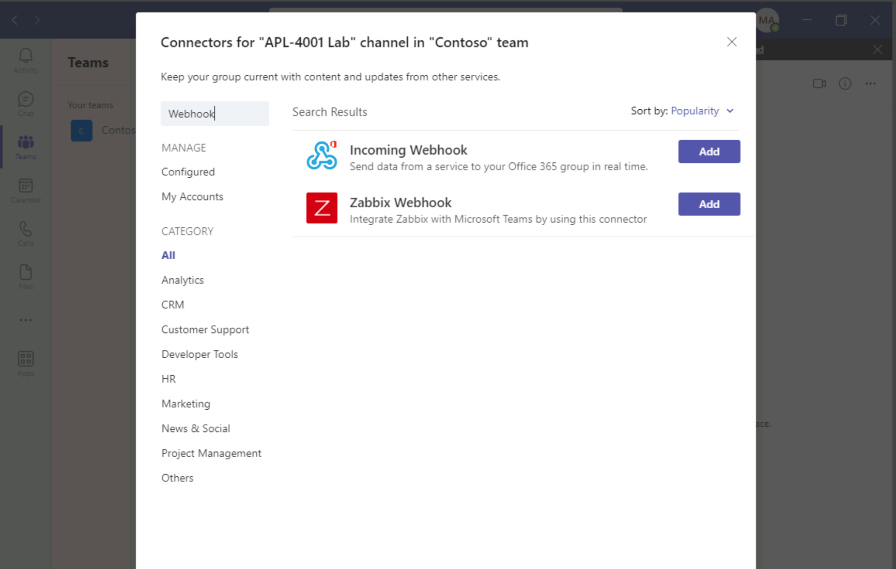

---
lab:
  title: Erstellen eines eingehenden Webhooks
  module: Exercise 2
---

# Übung 2: Erstellen eines eingehenden Webhooks

## Szenario

Angenommen, das IT-Supportteam verwendet einen Benachrichtigungsdienst eines Drittanbieters, um Warnungen und Meldungen zu verwalten. Kürzlich beschloss das Team, das Posten von Meldungen an einen Teams-Kanal zu automatisieren, der für kritische Aktualisierungen verwendet wird.  Der Drittanbieterdienst soll Nachrichten über einen Webhook posten.  

## Übungsaufgaben

Ihre Aufgabe besteht darin, einen neuen eingehenden Webhook mit dem Namen **Warnungen** zu erstellen, um diese Nachrichten zu empfangen.  Sie sollten auch den Webhook testen, um sicherzustellen, dass er eine Nachricht mit der Zeichenfolge `"Testing the Alerts endpoint."` akzeptieren und anzeigen kann. Das Team aktualisiert den Dienst mit der Webhook-Endpunkt-URL, wenn Sie Ihre Aufgaben ausgeführt haben.

Um die Übung abzuschließen, müssen Sie die folgenden Aufgaben ausführen:

1. Registrieren Sie einen eingehenden Webhook.
2. Veröffentlichen Sie eine Nachricht, um den Webhook zu testen.

**Geschätzte Abschlusszeit:** 8 Minuten

## Aufgabe 1: Registrieren eines eingehenden Webhooks

Registrieren Sie zunächst einen eingehenden Webhook.

**Hinweis:** Wenn das Teams-Konto, das Sie für diese Übung verwenden, noch nicht über ein Team mit einem Kanal verfügt, erstellen Sie einen neuen Kanal, bevor Sie die folgenden Schritte ausführen.

1. Navigieren Sie in Microsoft Teams zu einem Kanal, in dem Sie den Webhook konfigurieren können.
2. Wählen Sie im Kanal das Menü **Weitere Optionen** und dann **Connectors** aus.  (Hinweis: Verwenden Sie das Menü innerhalb des Kanals, nicht das Menü aus der Kanalliste.)
3. Suchen Sie nach `"webhook"`, und wählen Sie dann **Eingehender Webhook** aus.

   

4. Wählen Sie **Hinzufügen** aus.
5. Wählen Sie auf der Übersichtsseite die Option **Hinzufügen** aus.
6. Wählen Sie im Kanal erneut das Menü **Weitere Optionen** und dann **Connectors** aus.
7. Wählen Sie neben **Eingehender Webhook** die Option **Konfigurieren** aus.
8. Geben Sie für den Namen **Warnungen** ein.
9. Klicken Sie auf **Erstellen**.  Lassen Sie dieses Fenster geöffnet, damit Sie die URL während der nächsten Aufgabe kopieren können.

Sie haben einen eingehenden Webhook im Kanal konfiguriert.

## Aufgabe 2: Veröffentlichen Sie eine Nachricht, um den Webhook zu testen

Um den Webhook zu testen, verwenden Sie PowerShell, um eine Nachricht an den Webhook-Endpunkt zu senden.

1. Öffnen Sie **PowerShell**.
2. Führen Sie den folgenden Befehl aus, um die Nachricht zu senden.  Ersetzen Sie <YOUR WEBHOOK URL> mit der URL aus dem Webhook-Konfigurationsfenster in Teams aus der vorherigen Aufgabe:

     ```powershell
     Invoke-RestMethod -Method post -ContentType 'Application/Json' -Body '{"text":"Testing the Alerts endpoint."}' -Uri <YOUR WEBHOOK URL>
    ```

## Arbeit überprüfen

1. Navigieren Sie im Microsoft Teams-Client zur Registerkarte **Beiträge** des konfigurierten Kanals.
2. Überprüfen Sie, ob eine Nachricht im Kanal von `Alerts` vorhanden ist, die `"Testing the Alerts endpoint"` lautet.

 
