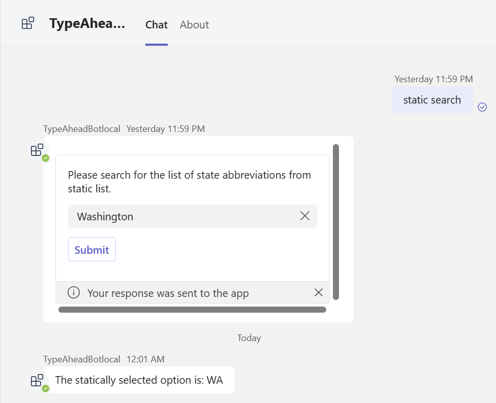
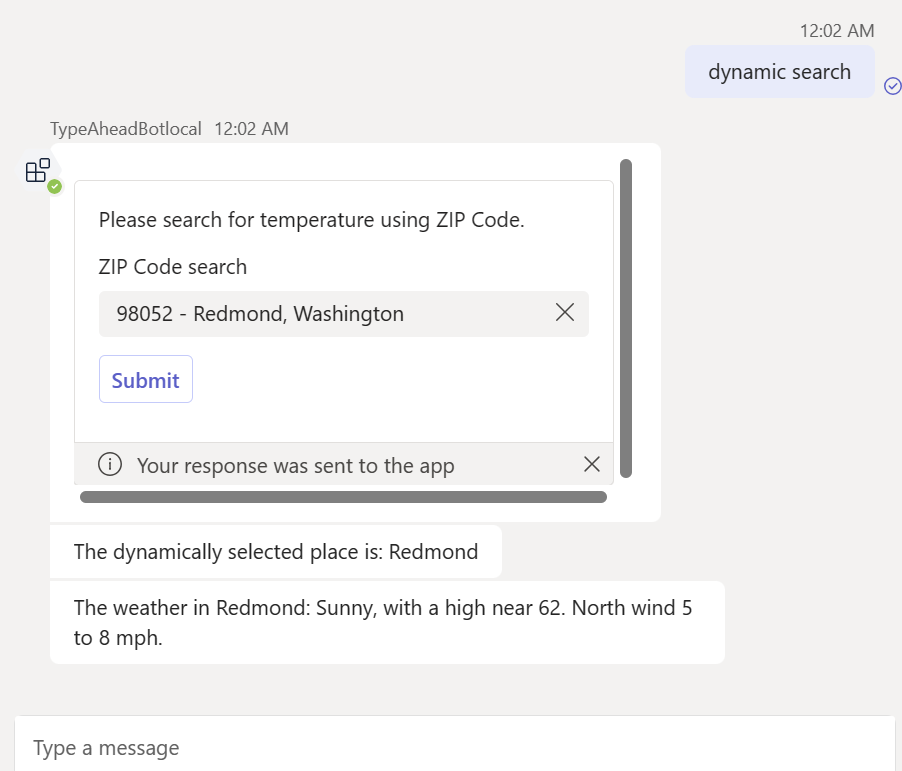

---
lab:
  title: Erstellen eines Basic-Bots
  module: Exercise 6
---

# Übung 6: Erstellen eines Basic-Bots

## Szenario
Angenommen, Sie wurden gebeten, dem IT-Supportteam bei der Erstellung eines Teams-Bots zu helfen. Dieser Bot verfügt über die Möglichkeit, die Abkürzung für einen bestimmten Staat abzurufen und die aktuellen Wetterbedingungen für einen bestimmten Bereich basierend auf seiner POSTLEITZAHL abzurufen.

## Übungsaufgaben
In dieser Übung verwenden Sie die Teams-Toolkit-Vorlage, um einen einfachen Teams-Bot zu erstellen. Dieser Bot verwendet die Teams KI-Bibliothek, um Nachrichten mit Benutzenden zu verarbeiten und Interaktionen mit adaptiven Karten einzuschließen. Beachten Sie, dass diese Übung keine Interaktionen zwischen der Teams-KI-Bibliothek und den LLMs umfasst.

Um die Übung abzuschließen, müssen Sie die folgenden Aufgaben erledigen:

1. Erstellen Sie einen Teams-Bot mit der Standard-Botvorlage aus dem Teams Toolkit.
1. Integrieren Sie die Teams-KI-Bibliothek.
1. Erstellen Sie adaptive Karten.
1. Verarbeiten Sie Nachrichten.

**Geschätzte Bearbeitungszeit:**  15 Minuten

## Aufgabe 1: Erstellen eines Teams-Bots mithilfe der Vorlage aus dem Teams-Toolkit

**Ziel**: Initialisieren Sie ein Basic-Teams-Bot-Projekt mit dem Teams-Toolkit in Visual Studio Code.

Verwenden Sie die ‚Vorlage für den Befehls-Bot, um einen neuen Bot zu erstellen:

1. Öffnen Sie Visual Studio Code.
1. Wählen Sie auf der Seitenleiste das Symbol für **Microsoft Teams** aus, um den Bereich **TEAMS-TOOLKIT** zu öffnen.
1. Wählen Sie die Schaltfläche **Neue App erstellen** aus.
1. Wählen Sie im Menü **Neues Projekt** die Option **Bot** und dann **Basic Bot** aus, um einen einfachen Bot zu erstellen.
1. Wählen Sie für die Programmiersprache **TypeScript** aus.
1. Wählen Sie unter **Arbeitsbereichsordner** einen Ordner aus, oder erstellen Sie einen, um Ihre Projektdateien auf dem Computer zu speichern.
1. Geben Sie für **Anwendungsname** **TypeAheadBot** ein und drücken Sie dann die **EINGABETASTE**. Das Teams-Toolkit erstellt ein Gerüst für eine neue App und öffnet den Projektordner in Visual Studio Code.
1. Möglicherweise erhalten Sie eine Nachricht von Visual Studio Code, die sie fragt, ob Sie den Autoren der Dateien in diesem Ordner vertrauen. Wählen Sie die Schaltfläche **Ja, ich vertraue den Autoren** aus, um fortzufahren.
1. Überprüfen Sie die Projektverzeichnisse und Dateien im Explorer in Visual Studio Code, um sich mit dem Quellcode vertraut zu machen.

## Aufgabe 2: Integrieren der Teams-KI-Bibliothek

**Ziel**: Fügen Sie Ihrem Projekt die Teams KI-Bibliothek hinzu, um die Funktionen des Bots zu verbessern.

1. Drücken Sie ``Ctrl + ` `` in Visual Code, um das Terminal zu öffnen.
1. Führen Sie im Terminal den folgenden Befehl aus, um die erforderlichen Teams KI-Bibliothek und Axios-Pakete zu installieren. Das Axios-Paket ist ein zusagebasierter HTTP-Client, den wir in dieser Übung verwenden werden, um Web-APIs aufzurufen.
   ```shell
   npm install @microsoft/teams-ai axios --save
   ```
1. Erstellen Sie eine `app.ts`-Datei im Stammverzeichnis Ihres Projekts. Fügen Sie den folgenden Code zur Datei hinzu, um das `app`-Objekt zu definieren und zu exportieren.
   ``` typescript
   // See https://aka.ms/teams-ai-library to learn more about the Teams AI library.
   import { Application } from "@microsoft/teams-ai";
   
   const app = new Application();
   
   export default app;
   ```
1. Öffnen Sie die `index.ts`-Datei im Stammverzeichnis des Projekts. Ersetzen Sie den Verweis auf `TeamsBot` durch das Objekt `app`. Auf die endgültige Datei `index.ts` kann in [index.ts](../../../Allfiles/Labs/Guided-Exercise6/index.ts) verwiesen werden.
   1. Ersetzen Sie den Abschnitt *Das Hauptdialogfeld dieses Bots.* durch den folgenden Code:
      
      Einfügen eines Codeausschnitts
      ``` typescript
      import app from "./app";
      ``` 
      Entfernen Sie den Codeausschnitt
      ``` typescript
      // This bot's main dialog.
      import { TeamsBot } from "./teamsBot";
      ```
   1. Entfernen Sie den Codeausschnitt *Erstellen Sie den Bot, der eingehende Nachrichten verarbeitet.*
      ``` typescript
      // Create the bot that will handle incoming messages.
      const bot = new TeamsBot();
      ```
   1. Ändern Sie den Codeausschnitt *Auf eingehende Anfragen lauschen.* So verwenden Sie das `app`-Objekt, um auf Nachrichten zu antworten.
      ``` typescript
      // Listen for incoming requests.
      server.post("/api/messages", async (req, res) => {
        await adapter.process(req, res, async (context) => {
          await app.run(context); //replace bot with app object
        });
      });
      ```

## Aufgabe 3: Erstellen adaptiver Karten

**Ziel**: Entwerfen und Implementieren von adaptiven Karten für statische und dynamische Dateninteraktionen innerhalb des Bots.

1. Erstellen Sie einen Ordner mit dem Namen `cards` in diesem Projektstammverzeichnis.
1. Erstellen Sie im Ordner `cards` eine Datei mit dem Namen `staticSearchCard.ts` und dem folgenden Inhalt. Auf die endgültige Datei `staticSearchCard.ts` kann in [staticSearchCard.ts](../../../Allfiles/Labs/Guided-Exercise6/staticSearchCard.ts) verwiesen werden.
   ```typescript
   import { Attachment, CardFactory } from 'botbuilder';

    export function createStaticSearchCard(): Attachment {
        return CardFactory.adaptiveCard({
            $schema: 'http://adaptivecards.io/schemas/adaptive-card.json',
            version: '1.2',
            type: 'AdaptiveCard',
            body: [
                {
                    text: 'Please search for the list of state abbreviations from static list.',
                    wrap: true,
                    type: 'TextBlock'
                },
                {
                    columns: [
                        {
                            width: 'stretch',
                            items: [
                                {
                                    choices:
                                        [
                                            { title: 'Alabama', value: 'AL' },
                                            { title: 'Alaska', value: 'AK' },
                                            { title: 'Arizona', value: 'AZ' },
                                            { title: 'Arkansas', value: 'AR' },
                                            { title: 'California', value: 'CA' },
                                            { title: 'Colorado', value: 'CO' },
                                            { title: 'Connecticut', value: 'CT' },
                                            { title: 'Delaware', value: 'DE' },
                                            { title: 'Florida', value: 'FL' },
                                            { title: 'Georgia', value: 'GA' },
                                            { title: 'Hawaii', value: 'HI' },
                                            { title: 'Idaho', value: 'ID' },
                                            { title: 'Illinois', value: 'IL' },
                                            { title: 'Indiana', value: 'IN' },
                                            { title: 'Iowa', value: 'IA' },
                                            { title: 'Kansas', value: 'KS' },
                                            { title: 'Kentucky', value: 'KY' },
                                            { title: 'Louisiana', value: 'LA' },
                                            { title: 'Maine', value: 'ME' },
                                            { title: 'Maryland', value: 'MD' },
                                            { title: 'Massachusetts', value: 'MA' },
                                            { title: 'Michigan', value: 'MI' },
                                            { title: 'Minnesota', value: 'MN' },
                                            { title: 'Mississippi', value: 'MS' },
                                            { title: 'Missouri', value: 'MO' },
                                            { title: 'Montana', value: 'MT' },
                                            { title: 'Nebraska', value: 'NE' },
                                            { title: 'Nevada', value: 'NV' },
                                            { title: 'New Hampshire', value: 'NH' },
                                            { title: 'New Jersey', value: 'NJ' },
                                            { title: 'New Mexico', value: 'NM' },
                                            { title: 'New York', value: 'NY' },
                                            { title: 'North Carolina', value: 'NC' },
                                            { title: 'North Dakota', value: 'ND' },
                                            { title: 'Ohio', value: 'OH' },
                                            { title: 'Oklahoma', value: 'OK' },
                                            { title: 'Oregon', value: 'OR' },
                                            { title: 'Pennsylvania', value: 'PA' },
                                            { title: 'Rhode Island', value: 'RI' },
                                            { title: 'South Carolina', value: 'SC' },
                                            { title: 'South Dakota', value: 'SD' },
                                            { title: 'Tennessee', value: 'TN' },
                                            { title: 'Texas', value: 'TX' },
                                            { title: 'Utah', value: 'UT' },
                                            { title: 'Vermont', value: 'VT' },
                                            { title: 'Virginia', value: 'VA' },
                                            { title: 'Washington', value: 'WA' },
                                            { title: 'West Virginia', value: 'WV' },
                                            { title: 'Wisconsin', value: 'WI' },
                                            { title: 'Wyoming', value: 'WY' }
                                        ],
                                    style: 'filtered',
                                    placeholder: 'Search for a state abbreviation',
                                    id: 'choiceSelect',
                                    type: 'Input.ChoiceSet'
                                }
                            ],
                            type: 'Column'
                        }
                    ],
                    type: 'ColumnSet'
                }
            ],
            actions: [
                {
                    id: 'staticSubmit',
                    type: 'Action.Submit',
                    title: 'Submit',
                    data: {
                        verb: 'StaticSubmit'
                    }
                }
            ]
        });
    }
   ```

1. Erstellen Sie im Ordner `cards` eine Datei mit dem Namen `dynamicSearchCard.ts` und dem folgenden Inhalt. Auf die endgültige Datei `dynamicSearchCard.ts` kann in [dynamicSearchCard.ts](../../../Allfiles/Labs/Guided-Exercise6/dynamicSearchCard.ts) verwiesen werden.
   ```typescript
   import { Attachment, CardFactory } from 'botbuilder';

   export function createDynamicSearchCard(): Attachment {
        return CardFactory.adaptiveCard({
            $schema: 'http://adaptivecards.io/schemas/adaptive-card.json',
            version: '1.6',
            type: 'AdaptiveCard',
            body: [
                {
                    text: 'Please search for temperature using ZIP Code.',
                    wrap: true,
                    type: 'TextBlock'
                },
                {
                    columns: [
                        {
                            width: 'stretch',
                            items: [
                                {
                                    choices: [],
                                    'choices.data': {
                                        type: 'Data.Query',
                                        dataset: 'locations',
                                        value: 'value'
                                    },
                                    id: 'choiceSelect',
                                    type: 'Input.ChoiceSet',
                                    placeholder: 'ZIP Code',
                                    label: 'ZIP Code search',
                                    isRequired: false,
                                    errorMessage: 'There was an error test.',
                                    isMultiSelect: false,
                                    style: 'filtered'                                
                                }
                            ],
                            type: 'Column'
                        }
                    ],
                    type: 'ColumnSet'
                }
            ],
            actions: [
                {
                    id: 'submitdynamic',
                    type: 'Action.Submit',
                    title: 'Submit',
                    data: {
                        verb: 'DynamicSubmit'
                    }
                }
            ]
        });
    }

   ```

## Aufgabe 4: Verarbeiten von Nachrichten

**Ziel**: Entwickeln Sie die Fähigkeit des Bots, auf Benutzereingaben zu reagieren und über adaptive Karten zu interagieren.

In diesem Schritt fügen wir dem `app`-Objekt Nachrichtenantwortfunktionen hinzu.

1. Öffnen Sie die Datei `app.ts` .
1. Fügen Sie unter dem Code, der das App-Objekt `const app = new Application();` erstellt, den folgenden Code hinzu, um unterschiedliche Nachrichten zu verarbeiten.
    ``` typescript
    interface SubmitData {
        choiceSelect?: string;
    }

    app.message(/static/i, async (context, _state) => {
        const attachment = createStaticSearchCard();
        await context.sendActivity({ attachments: [attachment] });
    });

    app.message(/dynamic/i, async (context, _state) => {
        const attachment = createDynamicSearchCard();
        await context.sendActivity({ attachments: [attachment] });
    });

    // Listen for query from dynamic search card
    app.adaptiveCards.search('locations', async (context: TurnContext, state: TurnState, query) => {
        // Format search results
        const locations: AdaptiveCardSearchResult[] = [];
        // Execute query
        const searchQuery = query.parameters['queryText'] ?? '';
        if (searchQuery.length < 4) {
            return locations;
        }   

        const response = await axios.get(
            `https://zip-api.eu/api/v1/codes/postal_code=US-${searchQuery}*`
        );

        interface DataObject {
            state: string;
            place_name: string;
            postal_code: string;
            lat:string
            lng:string
        };

        //response data is an array of objects or an object
        response.data = Array.isArray(response.data) ? response.data : [response.data];
        response.data.forEach((obj: DataObject) => {
            const result: AdaptiveCardSearchResult = {
                title: `${obj.postal_code} - ${obj.place_name}, ${obj.state}`,
                value: `${obj.postal_code}|${obj.place_name}|${obj.lat}|${obj.lng}`
            };
            locations.push(result);
        });

        // Return search results
        return locations;
    });

    // Listen for submit buttons
    app.adaptiveCards.actionSubmit('DynamicSubmit', async (context, _state, data: SubmitData) => {
        let [postalCode, placeName, lat, lon] = data.choiceSelect?.split('|') ?? [];
        await context.sendActivity(`The dynamically selected place is: ${placeName}`);
        const weatherLocation = await axios.get(
            `https://api.weather.gov/points/${lat},${lon}`
        );
        const forcast = await axios.get(weatherLocation.data.properties.forecast);
        await context.sendActivity(`The weather in ${placeName}: ${forcast.data.properties.periods[0].detailedForecast}`);
        });

        app.adaptiveCards.actionSubmit('StaticSubmit', async (context, _state, data: SubmitData) => {
        await context.sendActivity(`The statically selected option is: ${data.choiceSelect}`);
        });

        // Listen for ANY message to be received. MUST BE AFTER ANY OTHER HANDLERS
        app.activity(ActivityTypes.Message, async (context, _state) => {
        await context.sendActivity(`Try saying "static search" or "dynamic search".`);
    });
    ```

1. Aktualisieren Sie verwandte Verweise oben in der `app.ts`-Datei wie folgt. Auf die endgültige Datei `app.ts` kann in [app.ts](../../../Allfiles/Labs/Guided-Exercise6/app.ts) verwiesen werden.
    
    Aktualisiert
    ```` typescript
    import { ActivityTypes, TurnContext } from "botbuilder";
    import { createStaticSearchCard } from "./cards/staticSearchCard";
    import { createDynamicSearchCard } from "./cards/dynamicSearchCard";
    import axios from "axios";
    // See https://aka.ms/teams-ai-library to learn more about the Teams AI library.
    import { Application, TurnState, AdaptiveCardSearchResult } from "@microsoft/teams-ai";
    ````
    Vorherige
    ```` typescript
    // See https://aka.ms/teams-ai-library to learn more about the Teams AI library.
    import { Application } from "@microsoft/teams-ai";
    ````    

## Arbeit überprüfen

Führen Sie Ihre App lokal aus, um die Funktionalität zu testen:

1. Öffnen Sie das **TEAMS TOOLKIT**-Pannel. Wählen Sie im Menü **LEBENSZYKLUS** die Option **Vorschau Ihrer Teams-App** aus (oder verwenden Sie die Taste `F5`), und wählen Sie dann in Ihrem bevorzugten Browser **In Teams debuggen ()** aus.  
1. Das Teams-Toolkit stellt Ihre App bereit und führt sie lokal in einem Browser aus.
1. Wählen Sie im Browser im Dialogfeld für die App-Installation **Hinzufügen** aus, um Ihre Teams-App zu installieren.  Teams öffnet eine Unterhaltung mit Ihrem installierten Bot.
1. Geben Sie `static search` in das Nachrichtendialogfeld ein, und drücken Sie die Eingabetaste. Der Bot gibt eine adaptive Karte zurück.
1. Wählen Sie im Eingabefeld den Namen eines Staats aus, oder geben Sie ihn ein, und wählen Sie die Schaltfläche **Absenden** aus. Der Bot gibt die Abkürzung für diesen Staatsnamen zurück. 
1. Geben Sie `dynamic search` in das Nachrichtendialogfeld ein, und drücken Sie die Eingabetaste.
1. Geben Sie im Eingabedialogfeld eine US-Postleitzahl ein und wählen Sie die Schaltfläche **Absenden** aus. Der Bot gibt das aktuelle Wetter für diesen Bereich zurück. 